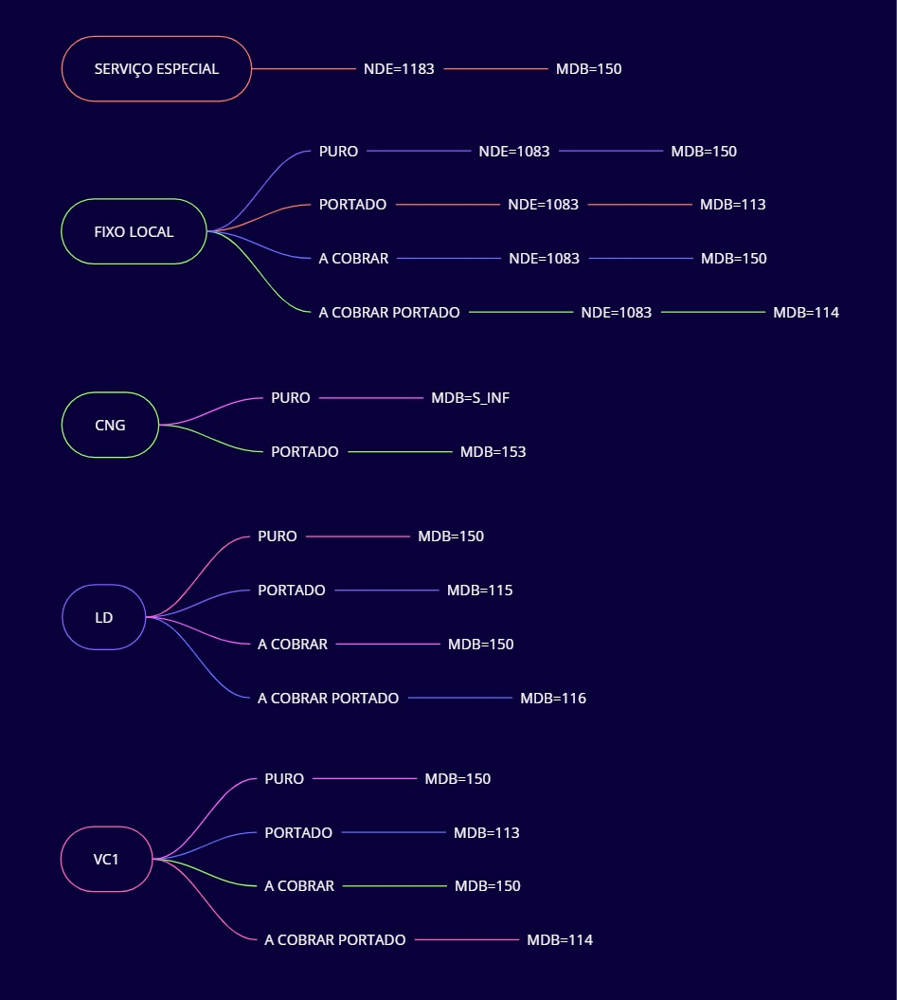
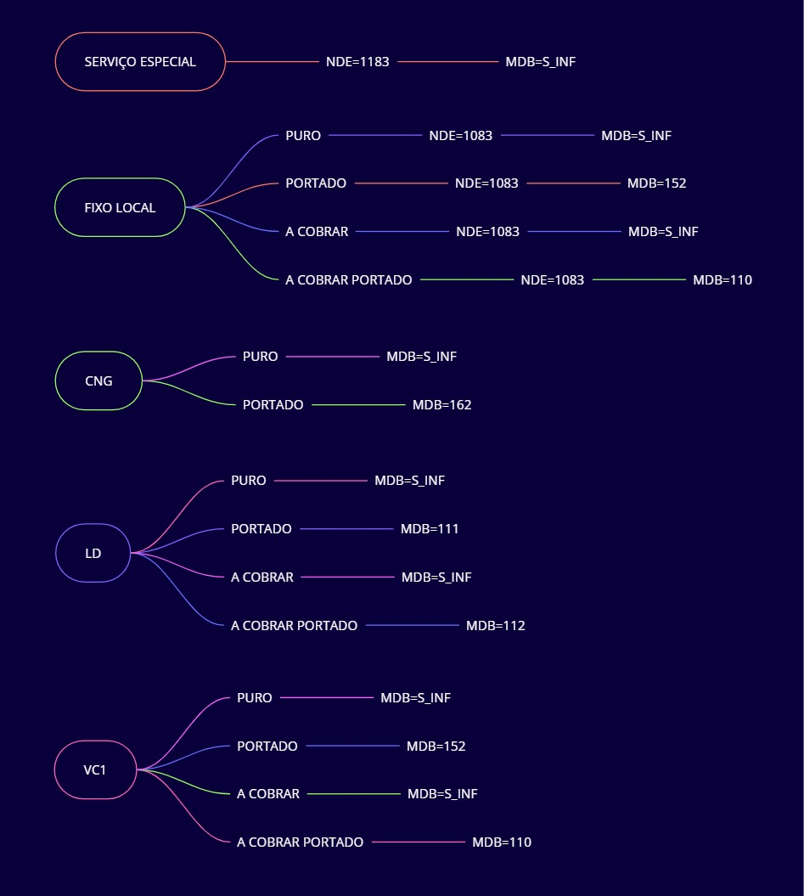

# 🌐 **ROTAS SIP**

Este é o projeto de configuração de rotas SIP. Aqui está a documentação de encaminhamentos.

---

## 🖼️ MDBs

    

        
<strong>SMP</strong>

        
    

    

        
<strong>STFC</strong>

        
    

